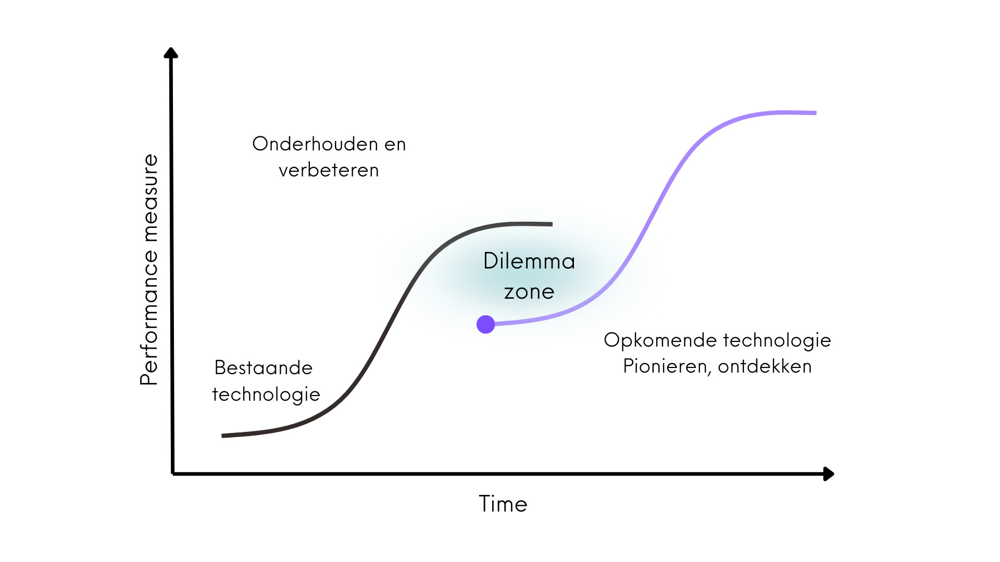

---
#
# By default, content added below the "---" mark will appear in the home page
# between the top bar and the list of recent posts.
# To change the home page layout, edit the _layouts/home.html file.
# See: https://jekyllrb.com/docs/themes/#overriding-theme-defaults
#
layout: home
title: Aanpak
---

## Missie en aanpak

Solid is een initatief van de grondlegger van het World Wide Web, Sir Tim Berners Lee, om het web veiliger, vriendelijker en innovatiever te maken.
Het maakt het mogelijk om verantwoord en veilig data te delen op basis van open standaarden en gebaseerd op waardes zoals zelfbeschikking, keuzevrijheid, vertrouwen en transparantie.
Het is een middel om bij te dragen aan een mensgerichte, vriendelijke en veilige gebruikerservaring in de digitale ruimte.

De open technologie achter Solid maakt het bijvoorbeeld mogelijk om in een persoonlijke datakluis gegevens te beheren.      Hierdoor krijg je als mens de regie terug over jouw gegevens, en beslis je zelf welke gegevens je deelt, met welke organisatie en voor hoe lang. Een belangrijk principe van Solid is dat data zo worden opgeslagen dat alle applicaties en organisaties deze kunnen begrijpen en verwerken.

Solid is toepasbaar in vrijwel alle sectoren, van de energiesector, media, gezondheidszorg tot overheid. Zowel een verbetering van de gebruikerservaring als de dienstverlening kan hierdoor worden mogelijk gemaakt. Een uitbreiding op het huidige web gaat echter niet vanzelf: er is brede bewustwording, onderzoek en ontwikkeling voor nodig.

### Dilemma zone 

Bij opkomende technologiën
