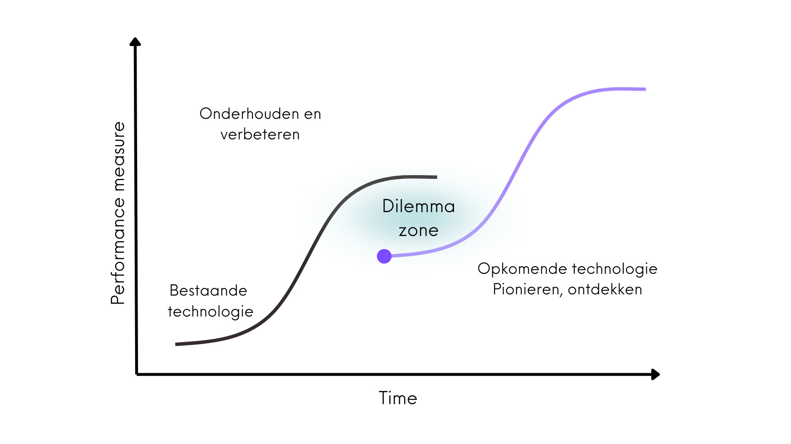
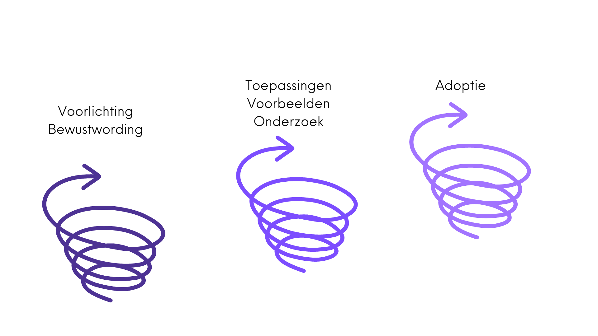
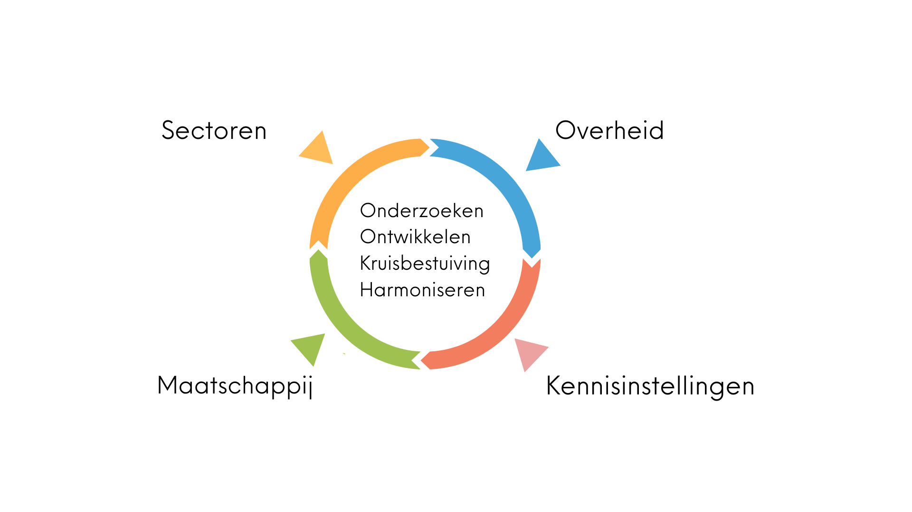

---
#
# By default, content added below the "---" mark will appear in the home page
# between the top bar and the list of recent posts.
# To change the home page layout, edit the _layouts/home.html file.
# See: https://jekyllrb.com/docs/themes/#overriding-theme-defaults
#
layout: home
title: Aanpak
---

## Missie en aanpak

Solid is een initatief van de grondlegger van het World Wide Web, Sir Tim Berners Lee, om het web veiliger, vriendelijker en innovatiever te maken.
Het maakt het mogelijk om verantwoord en veilig data te delen op basis van open standaarden en gebaseerd op waardes zoals zelfbeschikking, keuzevrijheid, vertrouwen en transparantie.
Het is een middel om bij te dragen aan een mensgerichte, vriendelijke en veilige gebruikerservaring in de digitale ruimte.

De open technologie achter Solid maakt het bijvoorbeeld mogelijk om in een persoonlijke datakluis gegevens te beheren.      Hierdoor krijg je als mens de regie terug over jouw gegevens, en beslis je zelf welke gegevens je deelt, met welke organisatie en voor hoe lang. Een belangrijk principe van Solid is dat data zo worden opgeslagen dat alle applicaties en organisaties deze kunnen begrijpen en verwerken.

Solid is toepasbaar in vrijwel alle sectoren, van de energiesector, media, gezondheidszorg tot overheid. Zowel een verbetering van de gebruikerservaring als de dienstverlening kan hierdoor worden mogelijk gemaakt. Een uitbreiding op het huidige web gaat echter niet vanzelf: er is brede bewustwording, onderzoek en ontwikkeling voor nodig.

## Dilemma zone 

Bovenstaande grafiek is gebaseerd op een onderzoek van Clayton Christensen, professor aan de Harvard Business School over opkomende technologiën. 
Organisaties zijn vaak gericht op de bekende technologiën die ze onderhouden en verbeteren. In de initiële fase van opkomende technologiën zijn er vaak nog geen voorbeelden en concrete toepassingen. Het resultaat is vaak dat iedereen blijft afwachten tot de technologie verder is. Echter, dan ontstaat geen beweging.
Als Stichting Solid Community willen we die beweging op gang brengen en toeleiden naar adoptie.

## Onderzoeken in plaats van onderhouden
Een opkomende technlogie vraagt daarbij een andere insteek dan een gevestigde technologie: een onderzoekende en iteratieve houding.
Dit is een andere houding dan plannen en onderhouden, en dat is vaak wennen voor organisaties en sectoren.

## Samenhang en integrale transitie
Een nieuwe technologie als Solid heeft invloed op allerlei onderdelen. Ze gaan niet alleen over techniek maar ook over gebruikers meer centraal stellen en regie geven, een nieuw digitaal landschap creëren, gedrag, communicatie, bedrijfsmodellen en de rol van de overheid. Voor een optimale ontwikkeling en adoptie moeten de verschillende onderdelen zoals de architectuur en governance op elkaar worden afgestemd en in samenhang zijn.

## Brede community
Het proces van onderzoek en ontwikkeling van Solid kunnen we in Nederland daarom alleen in samenhang aanpakken. Een community zorgt voor samenhang en harmonisatie van deze processen: samen leren, gezamenlijk uitdagingen aangaan en afstemmen zodat er uiteindelijk één geheel ontstaat voor de eindgebruiker.
Samen met eindgebruikers, bedrijven, maatschappelijke organisaties, kennisinstellingen en overheid om zo een veiliger en innovatiever web te creëren.

Wil jij onderdeel worden van een netwerk dat werkt aan een vriendelijker, veiliger, en innovatiever web?
Neem dan contact op met ons via <samenwerken@solidcommunity.nl>

