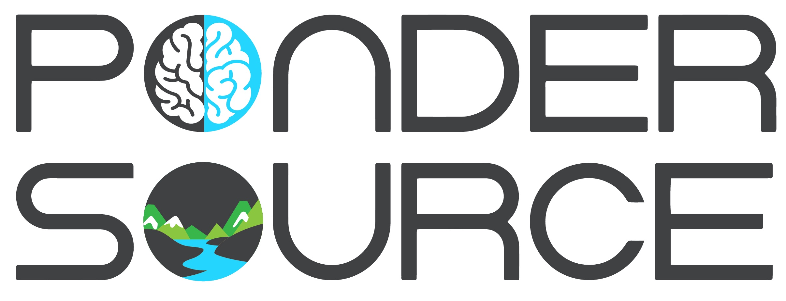
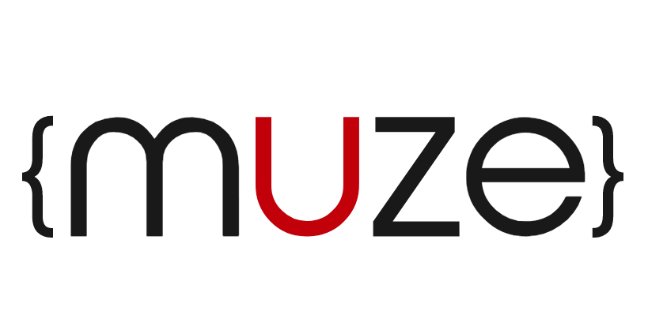

---
#
# By default, content added below the "---" mark will appear in the home page
# between the top bar and the list of recent posts.
# To change the home page layout, edit the _layouts/home.html file.
# See: https://jekyllrb.com/docs/themes/#overriding-theme-defaults
#
layout: home
title: Home
image:
  path: img/page/ballonnen.jpg
  height: 518
  width: 291
---

## Samenwerken aan een vriendelijker, veiliger en innovatiever web
Solid is een initatief van de grondlegger van het World Wide Web, Sir Tim Berners Lee, om het web veiliger, vriendelijker en innovatiever te maken.  
De missie van de Stichting Solid Community is om Solid verder op te schalen in Nederland vanuit een onafhankelijke en neutrale insteek. 
Dat doen we door: 

* bewustwording en cross-sectorale samenwerking te organiseren en zo;  
* **sectorbrede groeiende coalitie en community van samenwerking** te realiseren in onderzoek, ontwikkeling, kennisdeling en kruisbestuiving om zo de ontwikkeling van zaken zoals architectuur, governance en adoptie te harmoniseren tot een samenhangend geheel en uitdagingen samen aan te gaan.   
* Daarnaast ontwikkelen we samen met partners **concrete voorbeelden en toepassingen**.
   
 
<form action="aanpak.html">
    <input type="submit" value="Lees meer over Solid, onze missie en aanpak" id="nameform" class="btn btn-info" style="-webkit-box-sizing: border-box;-moz-box-sizing: border-box;box-sizing: border-box;margin: 0;font: inherit;color: white;overflow: visible;text-transform: none;-webkit-appearance: button;cursor: pointer;font-family: inherit;font-size: 16px;line-height: 1.42857143;display: inline-block;padding: 10px 32px;margin-bottom: 0;font-weight: bold;text-align: center;white-space: nowrap;vertical-align: middle;-ms-touch-action: manipulation;touch-action: manipulation;-webkit-user-select: none;-moz-user-select: none;-ms-user-select: none;user-select: none;background-image: none;border: 1px solid transparent;border-radius: 30px;background-color: #5bc0de;border-color: #46b8da;border-width: 0;margin-top: 5px; margin-left: 0px ;width: auto;"/>
</form>

---

## Projecten
Er zijn verschillende toepassingen in voorbereiding zowel in Nederland als internationaal. Bekijk hier enkele van deze toepassingen.
<form action="toepassingen.html">
    <input type="submit" value="Voorbeelden van toepassingen" id="nameform" class="btn btn-info" style="-webkit-box-sizing: border-box;-moz-box-sizing: border-box;box-sizing: border-box;margin: 0;font: inherit;color: white;overflow: visible;text-transform: none;-webkit-appearance: button;cursor: pointer;font-family: inherit;font-size: 16px;line-height: 1.42857143;display: inline-block;padding: 10px 32px;margin-bottom: 0;font-weight: bold;text-align: center;white-space: nowrap;vertical-align: middle;-ms-touch-action: manipulation;touch-action: manipulation;-webkit-user-select: none;-moz-user-select: none;-ms-user-select: none;user-select: none;background-image: none;border: 1px solid transparent;border-radius: 30px;background-color: #5bc0de;border-color: #46b8da;border-width: 0;margin-top: 5px; margin-left: 0px ;width: auto;"/>
</form>
 
### Toeslagen aanvragen
In Nederland hebben we een eerste proefopstelling ontwikkelt om het aanvragen van toeslagen te vereenvoudigen. Dit project heet het Virtueel Inkomsten Loket.
<form action="VIL.html">
    <input type="submit" value="Virtueel Inkomsten Loket" id="nameform" class="btn btn-info" style="-webkit-box-sizing: border-box;-moz-box-sizing: border-box;box-sizing: border-box;margin: 0;font: inherit;color: white;overflow: visible;text-transform: none;-webkit-appearance: button;cursor: pointer;font-family: inherit;font-size: 16px;line-height: 1.42857143;display: inline-block;padding: 10px 32px;margin-bottom: 0;font-weight: bold;text-align: center;white-space: nowrap;vertical-align: middle;-ms-touch-action: manipulation;touch-action: manipulation;-webkit-user-select: none;-moz-user-select: none;-ms-user-select: none;user-select: none;background-image: none;border: 1px solid transparent;border-radius: 30px;background-color: #5bc0de;border-color: #46b8da;border-width: 0;margin-top: 5px; margin-left: 0px ;width: auto;"/>
</form>

  

## Samenwerkingspartners en sponsoren

### Samenwerkingspartners

     
  

### Sponsoren
 

