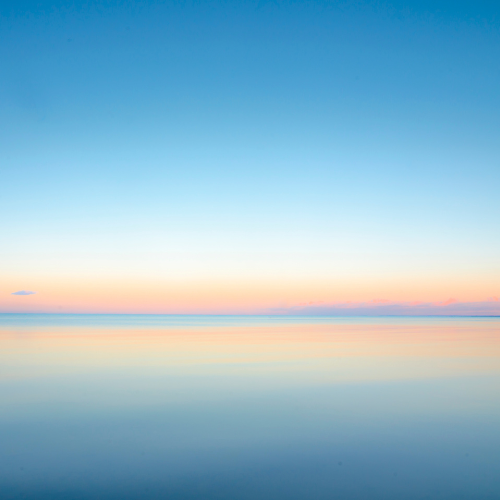

---
#
# By default, content added below the "---" mark will appear in the home page
# between the top bar and the list of recent posts.
# To change the home page layout, edit the _layouts/home.html file.
# See: https://jekyllrb.com/docs/themes/#overriding-theme-defaults
#
layout: home
---

## Projecten
<video src="https://user-images.githubusercontent.com/28604639/146938627-beb71c68-b6d6-4d9f-a7eb-2d23c5b95e14.mov" controls="controls" style="max-width: 730px;"></video>

 
 
          

some text floating around the image. And more text. 
Text on new line.  
text after line break.

 

A "newline". This text doesn't float anymore, is left-aligned.

[go](http://stackoverflow.com){:target="_blank" rel="noopener"}
