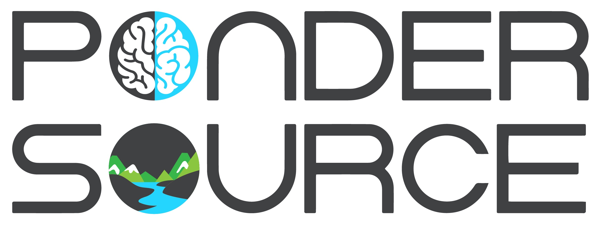
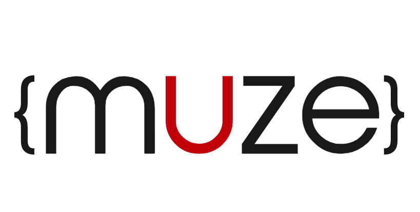

---
#
# By default, content added below the "---" mark will appear in the home page
# between the top bar and the list of recent posts.
# To change the home page layout, edit the _layouts/home.html file.
# See: https://jekyllrb.com/docs/themes/#overriding-theme-defaults
#
layout: home
title: Samenwerken
---

## Samenwerken aan een vriendelijker, veiliger en innovatiever web?

Werk je bij een organisatie en is er concrete interesse om aan de slag te gaan met projecten rondom veilig en verantwoord data delen, mogelijk in samenwerking met ketenpartners?
Neem dan contact op via: <samenwerken@solidcommunity.nl>
We werken doelgericht en stapsgewijs aan prototypes en live oplossingen die breder in de maatschappij toegepast kunnen worden en om veilig en verantwoord data delen te realiseren.
 
 
 

## Huidige samenwerkingspartners en sponsoren

Een groeiende groep van organisaties werkt samen met de Solid Community aan een vriendelijker en veiliger web.

### Samenwerkingspartners in veilig en verantwoord data delen
ICTU, innovatieorganisatie opgericht door de Nederlandse overheid 
 
     
 

### Sponsoren

 
 
 
